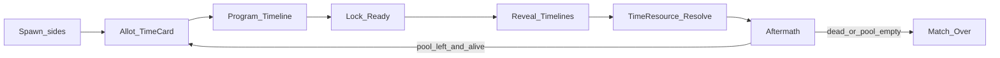

# Core Loop Sheet

**Doc ID:** D3  
**Status:** Updated 2026-07-30 — Time Card match loop (**C33**) + Polished Core Demo (**C34**)  
**Depends on:** [VISION.md](VISION.md), [SCOPE.md](SCOPE.md), [GDD.md](GDD.md), [PRODUCT_MEMORY.md](PRODUCT_MEMORY.md), [ART_DIRECTION.md](ART_DIRECTION.md)

---

## One-line loop

**Pick Character → play Time Card (commit N from match pool) → secretly draw path + stance + schedule Shoot (+ optional door) inside N → lock → reveal → resolve Time Resource → Playback → Aftermath → next Time Card (or Match Over).**

---

## Match cast (demo)

| Role | Meaning in demo |
|------|-----------------|
| Attacker / Defender | Spawn labels (**C18**); Character preset may differ |
| Players | **1v1 local** for 14-day ship (**C34**). Online Fusion = post-demo. Bot = nice-to-have (**C19**) |

---

## Timeline model (demo)

- **Character Card:** Speed / Agility / Strength (Scout / Juggernaut).
- **Time Card:** commits **N** from shared match pool (**C33**) — not a gear card.
- **Movement:** path + time slider → Sprint / Tactical Walk / Stealth Crawl (**not** a card) (**C21**).
- **Shoot:** aim + time slider → Snap Shot / Hold Angle (**not** a card) (**C25**).
- **Door:** one contextual open/close on the 5×5 board (blocks move + LoS) — not a full Interact card system (**C34**).
- One shared **match Time Resource pool** (demo **900s / 15 min**). Both sides program inside each round’s **N**.
- **Playback Duration** separate from Time Resource (**C27**).
- Program phase limited in **real-world** seconds (30s).
- **Presentation:** Desk-Lamp Diorama required floor (**C29** / **C34**).

**Deferred from 14-day ship:** Bandage / Flashbang / Adrenaline / Interact-as-card / Otherwise library / attic / vent / monitor / 高铁.

---

## Phases (second-to-second)

### 1. Spawn
- Place both pawns on the **5×5 ground** map (Attacker vs Defender spawns).
- Both fully visible (FoW Out).
- Match pool starts full (demo 900s). Round 1 Time Card chooser = Attacker.

### 2. Allot (Time Card)
- Current chooser commits **N** seconds from the remaining match pool (`N` ∈ `[MinRoundSeconds, Remaining]`).
- **N is spent in full** when played; unused seconds inside the round window are burned.
- Chooser alternates each round (Attacker ↔ Defender). Both sides still Program simultaneously inside **N** — only the allotment choice is turn-taking (**C33**).

### 3. Program Timeline (all players simultaneous)
**Player decides:**
- Character already chosen pre-match
- Path waypoints + time allotment (stance) — base Move verb, against the round's **N**
- Aim + time allotment (mode) — base Shoot verb
- Optional door open/close booked on the timeline from a legal tile

**Player does not:**
- Play a Walk/Dash card
- Play a Snap Shot/Hold Angle card
- Aim with twitch controls
- Draw Bandage/Flashbang/Adrenaline (post-demo)

### 4. Lock
- Each player Ready / timer auto-lock (UI must show waiting state; local demo may auto-advance).

### 5. Reveal
- Both timelines become visible (supports success metric: read cause/effect).

### 6. Time Resource resolve + Playback
- Authority steps continuous Time Resource; UI presents via ReplayTape.
- **Playback Duration** may compress long Time Resource spans so cinema stays watchable.
- Outcomes update pawn positions, door state, wounds/elim.

### 7. Invalid moves (demo simplification)
- Blocked path / closed door → stop before the block. Full Otherwise card library = post-demo (**C34**).

### 8. Aftermath / End check
- If a player is **eliminated** → Match Over (demo win).
- Else if the remaining pool cannot fund `MinRoundSeconds` → Match Over.
- Else → return to **Allot** for another round on **carried** map state (positions + wounds) (**C33**).

---

## Operations (demo verbs)

**Base verbs (not cards):**
- **Movement:** path + stance — Sprint (evades Snap) / Tactical Walk / Stealth Crawl.
- **Shoot:** aim + mode — Snap Shot (wound; misses Sprint; aimed tile only — **C32**) / Hold Angle (lethal; hits Sprint).

**Map action:**
- **Door** — open/close; Strength affects Time Resource cost (see GDD).

**Post-demo cards** (confirmed design, not 14-day ship): Bandage, Interact-as-card, Flashbang, Adrenaline.

---

## Map loop (how space enters decisions)

- **5×5 ground** + **one door** (demo ship).
- Attic / Vent / Monitor / 高铁 = Later (**C34** / **C31**).

---

## What “fun” must prove in 15 minutes

1. **Time Resource** ordering is readable on the scrubber (cause → effect).  
2. **Playback Duration** never confuses players into thinking TR seconds = wall-clock animation length.  
3. Walk / Sprint / Snap / Hold Angle feel like **mind-game RPS**, not arithmetic.  
4. The **door** changes a fight once.  
5. The board reads as a **desk-lamp diorama**, not a default Unity prototype (**C34**).

---

## Explicitly not in this loop (Out / Later)

FoW, decoys, extraction, loot, classes beyond attrs, alarm track, 4v4, Fusion online, full Android polish, gear cards, Otherwise library, attic/vent/monitor, final SSS/thumbprint clay. Long-term only, not this loop: continuous movement/navmesh (**C35**), destructible breach-state geometry (**C36**), asymmetric objective win (**C37**), Downed state + revive + Detonator (**C38**).

---

## Open for tuning only

Exact door placement, spawn coords, stance/shoot numeric magnitudes — set during implementation; GDD owns behavior.
