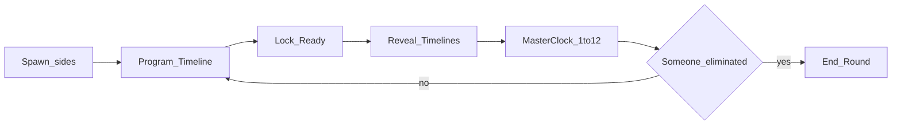

# Core Loop Sheet

**Doc ID:** D3  
**Status:** Updated 2026-07-28 — path/stance + Character Cards (aligned to GDD)
**Depends on:** [VISION.md](VISION.md), [SCOPE.md](SCOPE.md), [GDD.md](GDD.md)

---

## One-line loop

**Pick Character → secretly draw path + allot Time Resource (stance) + drop tactic cards → lock → reveal → Host resolves Time Resource → Playback (compressed OK) → wound/kill or next round.**

---

## Match cast (demo)

| Role | Meaning in demo |
|------|-----------------|
| Attacker / Defender | Spawn labels (**C18**); same tactic deck; Character preset may differ |
| Players | 1v1 online. Bot = nice-to-have (**C19**) |

---

## Timeline model (demo)

- **Character Card:** Speed / Agility / Strength (Scout / Juggernaut).
- **Movement:** path + time slider → Sprint / Tactical Walk / Stealth Crawl (**not** a card) (**C21**).
- **Shoot:** aim + time slider → Snap Shot / Hold Angle (**not** a card either — base verb, same pattern as Movement) (**C25**).
- **Cards:** remaining gear/tactics on path — Bandage / Interact / Flashbang / Adrenaline (max 3/round).
- Shared continuous **Time Resource** timeline (demo round window placeholder **60s**).
- **Playback Duration** separate from Time Resource (**C27**).
- Program phase limited in **real-world** seconds (30s).

---

## Phases (second-to-second)

### 1. Spawn
- Place both pawns on map (Attacker vs Defender spawns).
- Both fully visible (FoW Out).

### 2. Program Timeline (all players simultaneous)
**Player decides:**
- Character already chosen pre-match
- Path waypoints + time allotment (stance) — base Move verb
- Aim + time allotment (mode) — base Shoot verb
- Up to 3 cards on path/timeline (Bandage / Interact / Flashbang / Adrenaline)
- Otherwise Invalid→Stop where attached

**Player does not:**
- Play a Walk/Dash card
- Play a Snap Shot/Hold Angle card
- Aim with twitch controls

### 3. Lock
- Each player Ready / timer auto-lock (timer number TBD in GDD; UI must show waiting state).

### 4. Reveal
- Both timelines become visible (supports success metric: read cause/effect).

### 5. Time Resource resolve + Playback
- Host steps continuous Time Resource; clients present via ReplayTape.
- **Playback Duration** may compress long Time Resource spans so cinema stays watchable.
- Op outcomes update pawn positions, interactions, wounds/elim.

### 6. Otherwise (demo)
- If an op’s target/path is **invalid** at resolve time → fire Otherwise **`→ Stop`** (prove carryover / no wasted ghost action). Richer Otherwise = Later.

### 7. End check
- If a player is **eliminated** → round over (demo win).
- Else → return to Program for another round on same map state (or reset — prefer **continue on same state** unless GDD says reset).

---

## Operations (demo verbs)

**Base verbs (not cards):**
- **Movement:** path + stance — Sprint (evades Snap) / Tactical Walk / Stealth Crawl.
- **Shoot:** aim + mode — Snap Shot (wound; misses Sprint) / Hold Angle (lethal; beats Sprint).

**Cards** (see GDD):

| Card | Role in RPS / cornering |
|------|-------------------------|
| **Bandage** | Clear Wounded |
| **Interact** | Doors / Vent / Monitor (Strength affects doors) |
| **Flashbang** | Stun room; 1/match |
| **Adrenaline** | Instant −1 tick; 1/match |

---

## Map loop (how space enters decisions)

- **5×5 ground + 5×5 attic**
- **Doors:** area denial (block move + LoS)
- **Vent:** floor swap
- **Monitor:** highlight opponent (FoW still Off)

---

## What “fun” must prove in 15 minutes

1. **Time Resource** ordering is readable on the scrubber (cause → effect).  
2. **Playback Duration** never confuses players into thinking TR seconds = wall-clock animation length.
2. Walk / Dash / Snap / Hold Angle feel like **mind-game RPS**, not arithmetic.  
3. Wounded pressure + Bandage deadline matters.  
4. Doors + Vent change the duel obviously.  
5. Invalid → Otherwise Stop is readable.

---

## Explicitly not in this loop (Out / Later)

FoW, decoys, extraction, loot acts, classes, alarm track, 4v4, polished clay art.

---

## Open for tuning only

Exact map door placements, spawn coords, room definitions for Flashbang — set in map data during implementation; GDD owns behavior.
