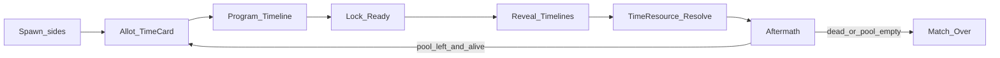

# Core Loop Sheet

**Doc ID:** D3  
**Status:** Updated 2026-08-08 — **C46 full scope pivot** (14-day-demo framing retired; loop unchanged — see `PRODUCT_MEMORY.md` C46). Prior: 2026-08-03 continuous-space pivot (**C35/C39**); 2026-07-30 Time Card match loop (**C33**) + C34 Polished Core Demo (superseded).  
**Depends on:** [VISION.md](VISION.md), [SCOPE.md](SCOPE.md), [GDD.md](GDD.md), [PRODUCT_MEMORY.md](PRODUCT_MEMORY.md), [ART_DIRECTION.md](ART_DIRECTION.md), [CONTINUOUS_PIVOT_PLAN.md](CONTINUOUS_PIVOT_PLAN.md)

---

## One-line loop

**Pick Character → play Time Card (commit N from match pool) → secretly draw path + stance + schedule Shoot (+ optional door) inside N → lock → reveal → resolve Time Resource → Playback → Aftermath → next Time Card (or Match Over).**

---

## Match cast (demo)

| Role | Meaning in demo |
|------|-----------------|
| Attacker / Defender | Spawn labels (**C18**); Character preset may differ |
| Players | **1v1** (**C2**); local play supported for testing; online PvP is the ship target (**C51**). |

---

## Timeline model (demo)

- **Character Card:** Speed / Agility / Strength (Scout / Juggernaut).
- **Time Card:** commits **N** from shared match pool (**C33**) — not a gear card.
- **Movement:** multi-waypoint path (tap to add each waypoint) + direct Sprint / Tactical Walk / Stealth Crawl pick → automatic Time Resource cost (**not** a card) (**C21**, amended 2026-08-03 — no manual time-allotment slider).
- **Shoot:** aim + direct Snap Shot / Hold Angle pick → automatic Time Resource cost (**not** a card) (**C25**).
- **Door:** one contextual open/close on the continuous arena, radius-based interact (blocks move + LoS) — not a full Interact card system (**C34** / **C39**).
- One shared **match Time Resource pool** (demo **900s / 15 min**). Both sides program inside each round’s **N**.
- **Playback Duration** separate from Time Resource (**C27**).
- Program phase limited in **real-world** seconds (30s).
- **Presentation:** Desk-Lamp Diorama required floor (**C29** / **C34**).

**Future roadmap, not in this ship's core loop:** Bandage / Flashbang / Adrenaline / Interact-as-card / Otherwise library / attic / vent / monitor / 高铁.

---

## Phases (second-to-second)

### 1. Spawn
- Place both pawns on the **continuous ground arena** (`[0,8]×[0,10]` footprint — Attacker vs Defender spawns).
- Both fully visible (FoW Out).
- Match pool starts full (demo 900s). Round 1 Time Card chooser = Attacker.

### 2. Allot (Time Card)
- Current chooser commits **N** seconds from the remaining match pool (`N` ∈ `[MinRoundSeconds, Remaining]`).
- **N is spent in full** when played; unused seconds inside the round window are burned.
- Chooser alternates each round (Attacker ↔ Defender). Both sides still Program simultaneously inside **N** — only the allotment choice is turn-taking (**C33**).

### 3. Program Timeline (all players simultaneous)
**Player decides:**
- Character already chosen pre-match
- Multi-waypoint path (tap to add each waypoint) + direct stance pick, no time allotment — base Move verb, against the round's **N**
- Aim + direct mode pick, no time allotment — base Shoot verb
- Optional door open/close booked on the timeline from within `InteractRadius`

**Player does not:**
- Play a Walk/Dash card
- Play a Snap Shot/Hold Angle card
- Aim with twitch controls
- Manually allot seconds to a Move or Shoot before it's scheduled — cost is automatic (**C21**)
- Draw Bandage/Flashbang/Adrenaline (future roadmap)

### 4. Lock
- Each player Ready / timer auto-lock (UI must show waiting state; local demo may auto-advance).

### 5. Reveal
- Both timelines become visible (supports success metric: read cause/effect).

### 6. Time Resource resolve + Playback
- Authority steps continuous Time Resource; UI presents via ReplayTape.
- **Playback Duration** may compress long Time Resource spans so cinema stays watchable.
- Outcomes update pawn positions, door state, wounds/elim.

### 7. Invalid moves (simplified for this ship)
- Blocked path / closed door → stop before the block. Full Otherwise card library remains future roadmap (**C46**, amends C34).

### 8. Aftermath / End check
- If a player is **eliminated** → Match Over.
- Else if the remaining pool cannot fund `MinRoundSeconds` → Match Over.
- Else → return to **Allot** for another round on **carried** map state (positions + wounds) (**C33**).

---

## Operations (ship verbs)

**Base verbs (not cards):**
- **Movement:** path + stance — Sprint (evades Snap) / Tactical Walk / Stealth Crawl.
- **Shoot:** free-aim point + mode — Snap Shot (wound; misses Sprint; `HitRadius` of the aim point — **C32/C39**) / Hold Angle (lethal; hits Sprint; `LaneHalfWidth`).

**Map action:**
- **Door** — open/close; Strength affects Time Resource cost (see GDD).

**Future roadmap cards** (confirmed design, not in this ship's core loop): Bandage, Interact-as-card, Flashbang, Adrenaline.

---

## Map loop (how space enters decisions)

- **Continuous ground arena** (`[0,8]×[0,10]`) + **two doors** (multi-room — **C45** / **C35/C39**).
- Attic / Vent / Monitor / 高铁 = Later (**C34** / **C31**).

---

## What “fun” must prove in 15 minutes

1. **Time Resource** ordering is readable on the scrubber (cause → effect).  
2. **Playback Duration** never confuses players into thinking TR seconds = wall-clock animation length.  
3. Walk / Sprint / Snap / Hold Angle feel like **mind-game RPS**, not arithmetic.  
4. The **door** changes a fight once.  
5. The board reads as a **desk-lamp diorama**, not a default Unity prototype — commercial ship art bar in [ART_DIRECTION.md](ART_DIRECTION.md).

---

## Explicitly not in this loop (Out / Later)

FoW, decoys, extraction, loot, classes beyond attrs, alarm track, 4v4, gear cards, Otherwise library, attic/vent/monitor. Android / portrait mobile is a separate future consideration (**C48**), not this ship’s polish target. Final SSS/thumbprint clay is Phase 5 commercial art bar scope (see `ART_DIRECTION.md`), not cut from this loop. Long-term only, not this loop: destructible breach-state geometry (**C36**), asymmetric objective win (**C37**), Downed state + revive + Detonator (**C38**). **Continuous movement is now IN this loop** (**C35** promoted 2026-08-03 — no longer long-term-only, see `CONTINUOUS_PIVOT_PLAN.md`). Online PvP is in ship scope (**C51**).

---

## Open for tuning only

Exact door placement, spawn coords, stance/shoot numeric magnitudes — set during implementation; GDD owns behavior.
