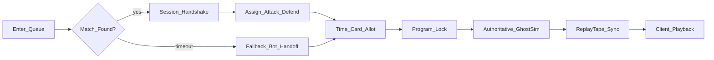

# Networking Design — Real PvP Transport

**Doc ID:** D14  
**Status:** Drafted 2026-08-08 (**C51**) — supersedes [TDD.md](TDD.md) §1 as the source of truth for networking  
**Depends on:** [PRODUCT_MEMORY.md](PRODUCT_MEMORY.md), [TDD.md](TDD.md), [SCOPE.md](SCOPE.md), [RISKS.md](RISKS.md), [SCHEDULE.md](SCHEDULE.md), [AI_FALLBACK_BOT.md](AI_FALLBACK_BOT.md)  
**Authority:** Real networking is **core ship scope** (**C51**). Transport choice, host-integrity answer, reconnect policy, and matchmaking numerics are OPEN.

---

## Honest inventory: what exists vs. what doesn't

**Today, "Photon Fusion Host Mode" is a label only.** Do not assume more infrastructure exists than the code proves.

### Real and reusable (code-verified under `Assets/_Project/Net/`)

- **Host-authoritative deterministic resolve** (**C23** / **C35**): Host (today: the local process acting as Host) computes on plain float math; clients play back only.
- **`TimelinePayload` / `ActionNode` → ghost sim → `ReplayTape` → client playback** shape — implemented and tested.
- **`GhostResolver`** revalidation discipline: resolve is a pure function of `(board, inputs)` — no `UnityEngine.Time`, no `Random`, no physics. Illegal / over-budget nodes are not trusted from the client; outcomes come only from Host tape events.
- Continuous pathfinding / LoS / Hold Angle sweep under `Assets/_Project/Sim/` already obey the same "never a physics raycast" determinism rule (**C32** carried forward).

### Does not exist yet

- No Photon Fusion (or any other net) package in `Packages/manifest.json`.
- Zero RPC / transport / session / lobby code anywhere in the project.
- Today's `GhostResolver` runs **both players' programs in the same Unity process** — there is no real network split at all. Local hotseat / scripted-defender stand-in only.
- No matchmaking queue, no reconnect path, no ranked identity, no anti-cheat beyond in-process payload checks.

This gap is the single largest distance between "working demo" and "shippable PvP product" (**R1** in [RISKS.md](RISKS.md)). Phase 2 exit criteria: a real two-process, real-transport tape-synced match, with an explicit host-integrity answer.

---

## What's reusable (do not rebuild)

This doc is about the **transport underneath** the resolve model — not a redesign of the resolve model itself.

Keep as-is:

1. Client compiles a `TimelinePayload` (`ActionNode[]`) during Program.
2. On Lock In, payload is sent to the authoritative resolver.
3. Authority runs ghost sim → emits immutable `ReplayTape`.
4. Clients scrub / animate from tape only; they never apply their own wound math.

Unique verbs (future roster) and the matchmaking-fallback bot (**C49**) must also emit programs through this same pipeline — see [CHARACTER_ROSTER_LONGTERM.md](CHARACTER_ROSTER_LONGTERM.md) and [AI_FALLBACK_BOT.md](AI_FALLBACK_BOT.md).

---

## Transport choice — OPEN (do not silently assume Fusion)

**C5** named Photon Fusion 2 Host Mode historically. **C51** promotes "real networking" to core scope but does **not** lock Fusion by itself — the package was never installed, so the choice was never proven in this codebase.

| Option | Why it might still be right | Why reopen |
|--------|-----------------------------|------------|
| **Photon Fusion 2** (Host Mode or Shared, TBD with integrity answer) | Built for Unity; matchmaking + relay services exist; original long-term plan; tick sync mental model already sketched in old TDD §1 | Never integrated here; Host Mode collides with the host-integrity problem below; cost / region coverage for Steam F2P unknown |
| **Other Unity-friendly stack** (e.g. NGO + Relay, Mirror + custom relay, Steam Networking + custom session) | Steam-native paths may simplify wallet + session identity; may pair cleaner with a dedicated/neutral host | Rewrites the "Fusion" label in docs/code comments; needs its own cost/estimate pass (**R16**) |

**Decision required before Phase 2 exits.** Whichever stack wins must support: session create/join, reliable payload RPC (or equivalent), tape sync to both peers, and a clean handoff point for the fallback bot after queue timeout. Do not pick unilaterally in implementation — lock it here first.

---

## Session & matchmaking flow

Target happy path (1v1 Attacker vs Defender for ship — **C2** / **C18**):

1. **Queue** — player enters matchmaking (ranked / casual split is OPEN).
2. **Match found** — two human peers paired; session handshake (role assign, build/version check, map lock).
3. **In-match** — existing Allot → Program → Lock → resolve → Playback loop; payloads cross the real transport; tape returns to both.
4. **Queue timeout** — if no human opponent within the timeout, hand off to the **invisible fallback bot**. Bot design lives in [AI_FALLBACK_BOT.md](AI_FALLBACK_BOT.md); this doc only owns the handoff point (session looks like a normal match from the human's side).

Queue timeout length is an OPEN numeric owned by the bot doc; matchmaking backend cost estimate is required before Phase 2 exits (**R16**).

---

## Host-integrity problem (treat with real weight)

Under classical **Fusion Host Mode**, Player 1 *is* the host running the authoritative resolve. That was fine for local hotseat — both "peers" trust each other by construction. It is a **real cheating vector** once ranked / monetized PvP ships: a malicious host can bias tape events, drop the opponent's legal nodes, or invent wounds (**R6** / **R7**).

Input revalidation ("Host checks Speed × Stance × budget") is **necessary but not sufficient** when the Host itself may be adversarial.

### Options (choice OPEN — describe, don't pick)

| Approach | Idea | Tradeoffs |
|----------|------|-----------|
| **Dedicated / neutral host** | Match runs on a server process neither player controls; both clients are pure playback | Strongest integrity; ongoing server cost; needs deploy/ops; best fit once population justifies it |
| **Server-authoritative relay** | Lightweight relay re-runs (or spot-checks) ghost sim on submitted payloads and is the only party that emits `ReplayTape` | Cheaper than full dedicated game servers if sim stays pure-C# and fast; still needs trusted infra; natural fit for this project's already-pure `GhostResolver` |
| **Replay-audit / anti-cheat layer** | Peers (or a deferred auditor) re-simulate from both payloads and flag tape divergence; bans / rollbacks on mismatch | Lower always-on cost; detection can be delayed; bad UX if a cheater already ruined the match; weaker for real-time ranked without a fast auditor |

**Phase 2 cannot exit** without an explicit chosen answer. Shipping Player-1-as-Host into monetized ranked play without one of the above is a known ship-blocker (**R6**).

---

## Reconnect / disconnect — OPEN (new design surface)

Local hotseat had no network to drop. Real PvP needs a policy. Key questions (do not invent answers here):

- Grace period length before a disconnect counts?
- Auto-forfeit vs. pause-and-wait vs. bot-substitute mid-match?
- Rejoin window — can the same Steam identity reclaim the seat inside the grace period?
- What happens to an in-flight Program timer / already-Locked payload when a peer drops?
- Does a disconnect during Playback differ from one during Allot/Program?

Until locked, implementers must not silently ship "instant forfeit on drop."

---

## Anti-cheat beyond input revalidation

Today's baseline (keep):

- Client suggests a path; authority **revalidates** Speed × Stance × budget / legality.
- Illegal nodes / teleports rejected; authority may substitute empty Wait or Otherwise Stop.
- Never apply damage/wounds from client RPCs — only from authoritative tape events.

Once there is a **cosmetic economy** and **ranked matchmaking** to protect, also required (design OPEN on mechanism, not on necessity):

- Host-integrity answer from the section above (non-negotiable).
- Identity binding (Steam ID ↔ session seat) so a banned host can't immediately requeue on a fresh anonymous peer.
- Tape / payload audit hooks sufficient to investigate disputed matches.
- Rate limits / queue abuse protections (dodge farming, bot-farming cosmetics — ties to [MONETIZATION.md](MONETIZATION.md)).
- Build/version gates so mismatched clients cannot desync-on-purpose.

---

## Implementation notes (future tasks — docs-only pass)

Recorded here so a later networking worker doesn't rediscover them:

- Install and pin the chosen transport package; remove "Fusion" wording from code comments if another stack wins.
- Split today's same-process dual-`GhostInput` call site into real send/receive of `TimelinePayload` and broadcast of `ReplayTape`.
- Role assign (Attacker / Defender) must survive session handshake, not only `GameBootstrap` local spawns.
- Wire queue-timeout → [AI_FALLBACK_BOT.md](AI_FALLBACK_BOT.md) seat fill behind the **same** payload interface a human uses.

---

## OPEN summary (Integrator tracking)

| # | Decision |
|---|----------|
| 1 | Transport stack (Fusion 2 vs alternative) |
| 2 | Host-integrity approach (dedicated / relay / replay-audit) |
| 3 | Ranked vs casual queue split |
| 4 | Reconnect / disconnect / forfeit / rejoin policy |
| 5 | Matchmaking backend ongoing-cost estimate (**R16**) |
| 6 | Anti-cheat audit retention & ban pipeline depth |
