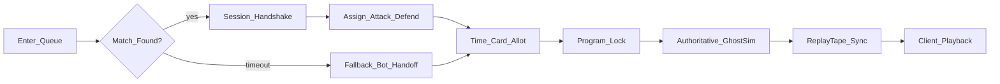

# Networking Design — Real PvP Transport

**Doc ID:** D14  
**Status:** Drafted 2026-08-08 (**C51**) — supersedes [TDD.md](TDD.md) §1 as the source of truth for networking  
**Depends on:** [PRODUCT_MEMORY.md](PRODUCT_MEMORY.md), [TDD.md](TDD.md), [SCOPE.md](SCOPE.md), [RISKS.md](RISKS.md), [SCHEDULE.md](SCHEDULE.md), [AI_FALLBACK_BOT.md](AI_FALLBACK_BOT.md)  
**Authority:** Real networking is **core ship scope** (**C51**). Transport choice, host-integrity answer, reconnect policy, and matchmaking numerics are OPEN.

---

## Honest inventory: what exists vs. what doesn't

**Today, "Photon Fusion Host Mode" is a label only.** Do not assume more infrastructure exists than the code proves.

### Real and reusable (code-verified under `Assets/_Project/Net/`)

- **Host-authoritative deterministic resolve** (**C23** / **C35**): Host (today: the local process acting as Host) computes on plain float math; clients play back only.
- **`TimelinePayload` / `ActionNode` → ghost sim → `ReplayTape` → client playback** shape — implemented and tested.
- **`GhostResolver`** revalidation discipline: resolve is a pure function of `(board, inputs)` — no `UnityEngine.Time`, no `Random`, no physics. Illegal / over-budget nodes are not trusted from the client; outcomes come only from Host tape events.
- Continuous pathfinding / LoS / Hold Angle sweep under `Assets/_Project/Sim/` already obey the same "never a physics raycast" determinism rule (**C32** carried forward).

### Does not exist yet

- No Photon Fusion (or any other net) package in `Packages/manifest.json`.
- Zero RPC / transport / session / lobby code anywhere in the project.
- Today's `GhostResolver` runs **both players' programs in the same Unity process** — there is no real network split at all. Local hotseat / scripted-defender stand-in only.
- No matchmaking queue, no reconnect path, no ranked identity, no anti-cheat beyond in-process payload checks.

This gap is the single largest distance between "working demo" and "shippable PvP product" (**R1** in [RISKS.md](RISKS.md)). Phase 2 exit criteria: a real two-process, real-transport tape-synced match, with an explicit host-integrity answer.

---

## What's reusable (do not rebuild)

This doc is about the **transport underneath** the resolve model — not a redesign of the resolve model itself.

Keep as-is:

1. Client compiles a `TimelinePayload` (`ActionNode[]`) during Program.
2. On Lock In, payload is sent to the authoritative resolver.
3. Authority runs ghost sim → emits immutable `ReplayTape`.
4. Clients scrub / animate from tape only; they never apply their own wound math.

Unique verbs (future roster) and the matchmaking-fallback bot (**C49**) must also emit programs through this same pipeline — see [CHARACTER_ROSTER_LONGTERM.md](CHARACTER_ROSTER_LONGTERM.md) and [AI_FALLBACK_BOT.md](AI_FALLBACK_BOT.md).

---

## Transport choice — LOCKED (C52, 2026-08-09)

**C5** named Photon Fusion 2 Host Mode historically. **C51** promoted "real networking" to core scope without locking Fusion by itself. That choice is now made — **see `PRODUCT_MEMORY.md` C52.**

**Chosen: a custom lightweight resolve-relay backend, not an off-the-shelf real-time netcode package.** Rationale: this game's Program → Lock In → Resolve → Playback loop is episodic (submit-then-resolve), not continuous real-time state — Fusion/NGO/Mirror are built for tick-synced continuous simulation with client prediction, which this project doesn't need and would be paying complexity/cost for. `GhostResolver` is already pure C# with no engine-time/physics/randomness dependency, so running it as the trusted authority in a small relay service is cheap and doesn't require a full game-server deploy.

**Shape:**

1. A small trusted service — plausibly a thin C# process that references the same `LogiCard.Sim`/`GhostResolver` code the client already uses, so resolve logic never drifts between "what the client previews" and "what the authority computes" — is the sole authority. It does not run Unity; it runs the same pure resolve function headless.
2. Each client, on Lock In, sends its locked `TimelinePayload` to the relay over a reliable connection (WebSocket vs. plain HTTPS request/response — exact protocol still OPEN, see below).
3. Once both payloads for a round arrive, the relay runs `GhostResolver.Resolve` once and returns the identical `ReplayTape` to both clients.
4. Clients never compute their own authoritative outcome — same trust shape `NETWORKING_DESIGN.md` already required, just moved off a same-process/player-hosted split onto the relay.

**Host-integrity model: server-authoritative relay** (the middle option in the table below) — chosen over a dedicated/neutral full game server (heavier ops than this needs) and over replay-audit/peer-trust (leaves the real cheating vector open, per R6, which this project already flagged as unacceptable for monetized ranked play).

**Still OPEN, not resolved by locking the architecture:** exact wire protocol (WebSocket vs HTTPS polling vs other), relay hosting/deploy target (a cheap always-on host vs. serverless-per-match invocation — turn-based cadence may make serverless viable, unexplored), session/matchmaking queue mechanics, and everything else in the OPEN summary below. Phase 2's first slice only needs to prove the shape end-to-end (two real processes, real transport, relay-computed tape) — it does not need production hosting or the full matchmaking flow yet.

---

## Session & matchmaking flow

Target happy path (1v1 Attacker vs Defender for ship — **C2** / **C18**):

1. **Queue** — player enters matchmaking (ranked / casual split is OPEN).
2. **Match found** — two human peers paired; session handshake (role assign, build/version check, map lock).
3. **In-match** — existing Allot → Program → Lock → resolve → Playback loop; payloads cross the real transport; tape returns to both.
4. **Queue timeout** — if no human opponent within the timeout, hand off to the **invisible fallback bot**. Bot design lives in [AI_FALLBACK_BOT.md](AI_FALLBACK_BOT.md); this doc only owns the handoff point (session looks like a normal match from the human's side).

Queue timeout length is an OPEN numeric owned by the bot doc; matchmaking backend cost estimate is required before Phase 2 exits (**R16**).

---

## Host-integrity problem (treat with real weight)

Under classical **Fusion Host Mode**, Player 1 *is* the host running the authoritative resolve. That was fine for local hotseat — both "peers" trust each other by construction. It is a **real cheating vector** once ranked / monetized PvP ships: a malicious host can bias tape events, drop the opponent's legal nodes, or invent wounds (**R6** / **R7**).

Input revalidation ("Host checks Speed × Stance × budget") is **necessary but not sufficient** when the Host itself may be adversarial.

### Options considered (choice LOCKED — C52, 2026-08-09)

| Approach | Idea | Tradeoffs |
|----------|------|-----------|
| **Dedicated / neutral host** | Match runs on a server process neither player controls; both clients are pure playback | Strongest integrity; ongoing server cost; needs deploy/ops; best fit once population justifies it — **rejected for now**, heavier ops than this stage needs |
| **Server-authoritative relay** ✅ **CHOSEN** | Lightweight relay re-runs ghost sim on submitted payloads and is the only party that emits `ReplayTape` | Cheaper than full dedicated game servers since `GhostResolver` stays pure-C# and fast; still needs trusted infra (the relay itself), but that's small — natural fit for this project's already-pure resolve function |
| **Replay-audit / anti-cheat layer** | Peers (or a deferred auditor) re-simulate from both payloads and flag tape divergence; bans / rollbacks on mismatch | Lower always-on cost; detection can be delayed; bad UX if a cheater already ruined the match — **rejected**, leaves R6's real cheating vector open, unacceptable once monetized ranked play is live |

Shipping Player-1-as-Host into monetized ranked play without one of the above was a known ship-blocker (**R6**) — resolved by locking server-authoritative relay.

---

## Reconnect / disconnect — OPEN (new design surface)

Local hotseat had no network to drop. Real PvP needs a policy. Key questions (do not invent answers here):

- Grace period length before a disconnect counts?
- Auto-forfeit vs. pause-and-wait vs. bot-substitute mid-match?
- Rejoin window — can the same Steam identity reclaim the seat inside the grace period?
- What happens to an in-flight Program timer / already-Locked payload when a peer drops?
- Does a disconnect during Playback differ from one during Allot/Program?

Until locked, implementers must not silently ship "instant forfeit on drop."

---

## Anti-cheat beyond input revalidation

Today's baseline (keep):

- Client suggests a path; authority **revalidates** Speed × Stance × budget / legality.
- Illegal nodes / teleports rejected; authority may substitute empty Wait or Otherwise Stop.
- Never apply damage/wounds from client RPCs — only from authoritative tape events.

Once there is a **cosmetic economy** and **ranked matchmaking** to protect, also required (design OPEN on mechanism, not on necessity):

- Host-integrity answer from the section above (non-negotiable).
- Identity binding (Steam ID ↔ session seat) so a banned host can't immediately requeue on a fresh anonymous peer.
- Tape / payload audit hooks sufficient to investigate disputed matches.
- Rate limits / queue abuse protections (dodge farming, bot-farming cosmetics — ties to [MONETIZATION.md](MONETIZATION.md)).
- Build/version gates so mismatched clients cannot desync-on-purpose.

---

## Implementation notes (future tasks — docs-only pass)

Recorded here so a later networking worker doesn't rediscover them:

- Role assign (Attacker / Defender) must survive session handshake, not only `GameBootstrap` local spawns.
- Wire queue-timeout → [AI_FALLBACK_BOT.md](AI_FALLBACK_BOT.md) seat fill behind the **same** payload interface a human uses.

### Phase 2, first slice — the exact seam and what it needs to become

Traced the real integration point (2026-08-09), so a worker doesn't have to rediscover it:

- **The call site:** `Assets/_Project/Boot/RoundPlayback.cs:112-140`, `ResolveAndArm()`. Today it loops every
  *locally registered* pawn (`_pawns`, populated via `Register(...)`), builds one `GhostInput` per pawn from
  `pawn.BuildPayload()` (a `Func<TimelinePayload>` closure reading that pawn's drafted `PawnProgram`), and
  calls `_resolver.Resolve(_inputs)` **synchronously, in-process** — this is the "same-process dual-GhostInput
  stand-in" the doc's Honest Inventory section already flags. Both Attacker's and Defender's (or the scripted
  AI's) payloads exist in the same call because there's only ever one process today.
- **Confirmed clean to relay:** `Assets/_Project/Sim/**` and `Assets/_Project/Net/GhostResolver.cs` (+ its
  `TimelinePayload`/`ActionNode`/`ReplayTape`/`TapeEvent` neighbors) have **zero `UnityEngine` references** —
  verified by grep, 2026-08-09. This is a plain, portable .NET library today, not just "no engine calls in the
  hot path" — it can be referenced directly by a non-Unity relay process with no porting work and zero risk of
  resolve-logic drift between what a client previews and what the relay computes authoritatively.
- **The seam:** introduce an `IMatchResolver` abstraction (`Task<ReplayTape> ResolveAsync(IReadOnlyList<GhostInput> inputs)`
  or equivalent) that `RoundPlayback` calls instead of `_resolver.Resolve(...)` directly. `ResolveAndArm()`
  already needs to become async either way (a real network round-trip takes real time) — `ProgramHud`'s
  `LockInRoutine()` (`Assets/_Project/UI/ProgramHud.cs`, Phase 1's addition) is already a coroutine, so
  awaiting an async resolve there is a small, natural change, not a rearchitecture.
- **Two implementations, both behind that one interface:**
  1. `LocalMatchResolver` — wraps *today's exact behavior* (same-process `GhostResolver.Resolve`, wrapped to
     return an already-completed `Task`). **Stays the default** for local hotseat, every existing PlayMode/
     EditMode test, and the matchmaking-fallback bot (Phase 3) — none of that should need to know a relay
     exists.
  2. `RelayMatchResolver` — sends this client's own `GhostInput` to the relay over the network, awaits the
     combined `ReplayTape` back. New code, new (small) relay-side project.
- **First-slice scope (proves the architecture, not the product):** a minimal standalone relay process — a
  plain console app referencing the same `Sim`/`Net` code — that accepts exactly two connections, pairs them
  into one match, waits for both `GhostInput`s, runs `GhostResolver.Resolve` once, returns the identical
  `ReplayTape` to both. No real matchmaking queue, no production hosting, no persistence — those are separate,
  still-OPEN items (see the summary table below). Exit proof: **two real OS processes** (e.g. two Unity Editor
  instances, or one Editor + one headless client) completing a round against each other through this relay
  over a real socket, with a new integration test asserting both processes end up with byte-identical tapes.
- **Exact wire protocol (WebSocket vs. plain TCP/HTTPS) is still OPEN** — pick whichever a worker can stand up
  fastest with .NET's built-in libraries (`System.Net.WebSockets` / `HttpListener`) without adding a new
  Unity package dependency; this is an implementation detail, not a design-review item, unlike the transport
  *architecture* decision itself (already locked, **C52**).

---

## OPEN summary (Integrator tracking)

| # | Decision | Status |
|---|----------|--------|
| 1 | ~~Transport stack (Fusion 2 vs alternative)~~ | **Locked C52** — custom resolve-relay backend |
| 2 | ~~Host-integrity approach (dedicated / relay / replay-audit)~~ | **Locked C52** — server-authoritative relay |
| 2b | Relay wire protocol (WebSocket vs HTTPS vs other) + hosting/deploy target | OPEN — not needed to prove Phase 2's first slice, needed before real ship |
| 3 | Ranked vs casual queue split | OPEN |
| 4 | Reconnect / disconnect / forfeit / rejoin policy | OPEN |
| 5 | Matchmaking backend ongoing-cost estimate (**R16**) | OPEN |
| 6 | Anti-cheat audit retention & ban pipeline depth | OPEN |
