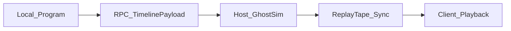

# D6: Technical Design Document (TDD)

**Doc ID:** D6  
**Status:** Stakeholder v1.0 — 2026-07-29  
**Also referenced as:** `TDD_v1.0_Engine_Architecture`  
**Focus:** Host-Authoritative Timeline Resolution (Unity + Photon Fusion)  
**Depends on:** [GDD.md](GDD.md), [TABLETOP_RULES.md](TABLETOP_RULES.md), [CORE_LOOP.md](CORE_LOOP.md)

---

## 1. Network Topology

* **Framework:** Photon Fusion (**Host Mode**).
* **Authority:** Strict **Host Authority**. Player 1 acts as Host/Server; Player 2 is Client. Host runs the **"Black Box"** simulation. Clients only render what the Host authorizes.
* **State Sync:** Tick-based state synchronization (Fusion ticks). Prevent cheating by never trusting client-side resolve outcomes.

---

## 2. Data Structures (The Timeline Payload)

When a player draws a path, sets stances, and drops cards on the UI timeline, the engine compiles this into a serialized struct: **`TimelinePayload`**.

The client sends this payload to the Host via **RPC**.

**Payload = array of `ActionNode`:**

| Field | Type | Example |
|-------|------|---------|
| `ExecuteTime` | `float` | `14.5` seconds (or quantized tick index in demo) |
| `GridPosition` | `Vector2` / `Vector2Int` | `(3, 4)` |
| `Stance` | `StanceType` enum | Sprint, Walk, Crawl |
| `Modifier` | `CardData` nullable | Flashbang, Hold Angle, Bandage, Breach/Interact |

Client-side pre-check: path must fit Character Speed × Stance math and time budget before Lock is allowed.

---

## 3. The Core Network Loop (Phase Transition)

### Phase 1: Local Programming (Clients)
Players draw paths and place cards in UI. **No network traffic** yet. Client verifies math vs Character attributes and budget.

### Phase 2: The Handshake (Client → Host RPC)
On timer zero or both **Lock In**: clients RPC `TimelinePayload` to Host. Input freezes; UI shows **"Simulating..."**.

### Phase 3: Host Resolution — Black Box (Host only)
Host receives both payloads. Runs **Ghost Simulation** with no requirement to render: steps timeline (second-by-second or fixed sim dt), updates ghost grid positions from Stance, grid LoS, wounds, card effects.

### Phase 4: The Playback Tape (Host → Clients)
Host compiles immutable **`ReplayTape`** (e.g. `Tick 140: P1 moves to X` · `Tick 145: P2 fires` · `Tick 145: P1 wounded`). Tape synced to all clients.

### Phase 5: Cinematic Execution (Clients)
Clients scrub UI and drive transforms/Animators from the same tape. **Desync of outcomes is impossible** — clients are playback, not simulators.



---

## 4. Resolving Mechanics (Host Logic)

### Pathing & Stances
* **No NavMesh** for resolve authority — strict **2D grid** math for determinism.
* Segment time ≈ `Distance * CharacterBaseSpeed * StanceModifier` (align constants with GDD / paper learnings).
* Host updates ghost coordinates each sim step along booked nodes.

### Combat & LoS
* LoS via **Bresenham** (or integer grid raycast) — **not** Unity physics raycasts for authority.
* Same-frame LoS both ways: compare **Stance** (e.g. Walk > Sprint). Equal stance → mutual wounds (paper) / lethal draw rules per GDD.

### Card Effects
* Event triggers at `ExecuteTime`. Example: Flashbang at `12.0s` stuns victims in radius → **+3.0s** delay, shifting subsequent `ActionNode` times backward on that ghost’s schedule.

### Demo quantization note
Digital build uses **continuous `ExecuteTime` (Time Resource seconds)** in `TimelinePayload`. **Playback Duration** on clients is separate and tunable (**C27/C28**). Do not quantize to a 12-tick clock. Fusion Host still owns the Black Box.

---

## 5. Art & Animation Integration

* Clients read timestamps only.
* **No root motion** — script moves transforms; clips play in place.
* Stop-motion feel: clips baked ~**12 fps** while game renders **60 fps**, or Animator update manipulated for stepped playback.

---

## 6. Suggested project folders (implementation)

```
Assets/_Project/
  Net/          # Fusion callbacks, RPCs, TimelinePayload, ReplayTape
  Sim/          # Host ghost sim, Bresenham LoS, stance math (pure C# preferred)
  Timeline/     # Payload compile from UI
  UI/           # Program / Lock / Simulating / Scrubber playback
  Board/        # Grid, doors, vent, monitor views
  Characters/   # Scout/Heavy attrs ScriptableObjects
  Cards/        # CardData ScriptableObjects
```

Pure C# under `Sim/` must be unit-testable without a running scene.

---

## 7. Security / anti-cheat baseline

* Client may suggest path; Host **revalidates** Speed × Stance × budget before accepting payload.
* Illegal nodes / teleports rejected; Host may substitute empty Wait or force Otherwise Stop.
* Never apply damage/wounds from client RPCs — only from Host tape events.
