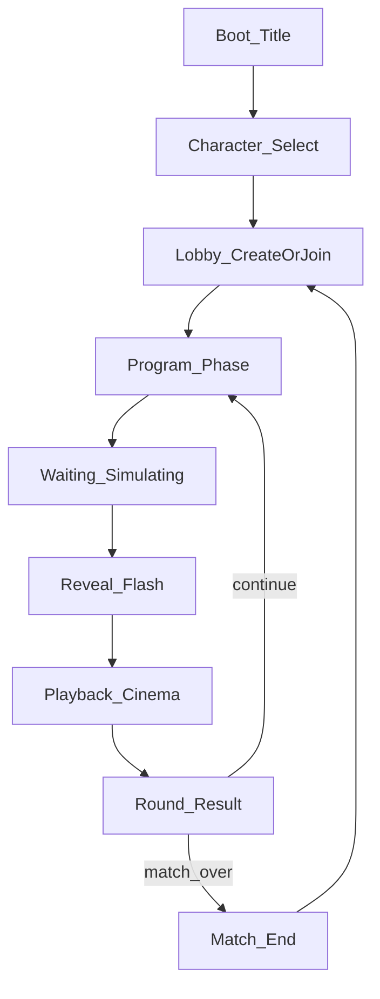

# D12: UI / UX Flow — 2-Week Demo

**Doc ID:** D12  
**Status:** Drafted 2026-07-29  
**Depends on:** [GDD.md](GDD.md), [TDD.md](TDD.md), [ART_DIRECTION.md](ART_DIRECTION.md), [PRODUCT_MEMORY.md](PRODUCT_MEMORY.md)  
**Platforms:** Windows (mouse) + Android (touch), **portrait, one-handed** primary (**C30**).

Glossary (**C27**): **Time Resource** = budget scrubber; **Playback Duration** = cinema length; **Real-world** = wall-clock only (e.g. Program countdown).

---

## Screen map

---

## 1. Boot / Title

- Game name + **Play**.  
- Minimal; no settings deep dive in demo.

---

## 2. Character Select

- Pick **Scout** or **Juggernaut** (attrs readable: Speed / Agility / Strength one-liners).  
- Confirm → Lobby.

---

## 3. Lobby (1v1)

- **Create room** → show join code.  
- **Join** → enter code.  
- Labels: Attacker / Defender (spawn only).  
- **Start** when 2 players ready (or debug Start with 1 for local Slice 1).  
- Note: prefer **Windows as Host** when mixed with Android.

---

## 4. Program Phase (core UX)

**Layout (portrait, one-handed — C30):** screen splits into three stacked bands, ordered so the further from the thumb, the less it is touched.

| Band | Screen share | Content | Touch |
|------|--------------|---------|-------|
| **Top strip** | ~10% | **Real-world** Program countdown (e.g. 30s), round/phase label, wound badges. | Read-only |
| **Board** | ~50% | Diorama board (tilt-shift camera), both 5×5 floors stacked. Yarn/chalk **path** while drawing. | Taps only — target tiles, aim tiles |
| **Thumb zone** | ~40% | **Time Resource scrubber**, gear **cards** (max 3), stance/shoot-mode band, **Lock In**. | All drags and precision input |

**Thumb-zone rules:**

- **Lock In** anchored bottom-right (right-thumb arc), ≥56dp, miss-tap resistant.
- Cards are a **horizontal strip** at the bottom — swipe to browse, tap to arm, then tap board target. **No card→board drag is ever required** (drag across the board is out of one-thumb reach).
- Scrubber sits directly above the cards so a thumb can scrub without covering the board.
- Nothing critical in the top two corners.

**Flow:**

1. **Move (base verb):** tap pawn → draw/set path → allot Time Resource → stance band (Sprint / Walk / Crawl) updates automatically or via slider.  
2. **Shoot (base verb):** aim direction/tile → allot Time Resource → mode Snap / Hold Angle.  
3. **Cards:** tap Bandage / Interact / Flashbang to arm, then tap the path node or scrubber time to place. Adrenaline is **Execution-only** (hidden or disabled here).  
4. Client validates TR budget fit before Lock allowed.  
5. Timer hit 0 or Lock → freeze input.

**One-handed (C30):** every step above is tap-then-tap — arm in the thumb zone, confirm on the board. Path uses waypoint taps, not free scribble. No two-finger gesture is required; pinch/rotate camera is optional convenience only.

---

## 5. Waiting / Simulating

- Full-screen or modal: **“Simulating…”**  
- No board interaction. Host running ghost (**TDD** Phase 3).

---

## 6. Reveal (short)

- Brief flash: enemy path/cards visible (or silhouette) — keep **&lt;2 real-world seconds** unless playtest wants longer.  
- Then auto-enter Playback.

---

## 7. Playback (Cinema)

- Same board; paths may ghost.  
- Scrubber plays in **Playback Duration** time (may be faster than Time Resource).  
- Optional dual readout later: TR marker vs playback head — **Slice 1:** one scrubber showing event order is enough if labels say “Playback.”  
- **Adrenaline:** large button during Playback, **1/match**, only while you have an active segment.  
- No pause required for demo; Skip optional for debug builds only.

---

## 8. Round Result

- Healthy / Wounded / Dead summary.  
- **Continue** (next Program) or **Match Over** if Dead/Draw.

---

## 9. Match End

- Winner / Draw.  
- **Rematch** → Lobby. **Quit** → Title.

---

## Interaction rules (all Program UI)

| Rule | Spec |
|------|------|
| Orientation | **Portrait lock** (no autorotate); Windows uses the same portrait layout in a tall window (**C30**) |
| Reach | Every primary action inside the bottom ~40% thumb arc; board taps are single, forgiving targets |
| Gestures | Single-thumb tap only for required actions; no mandatory drag or multi-touch |
| Tap targets | ≥48dp; Lock In / Adrenaline ≥56dp |
| Contrast | AR timeline readable on clay board ([ART_DIRECTION.md](ART_DIRECTION.md)) |
| Feedback | Lock In = physical switch SFX; card drag = paper shuffle |
| Errors | Invalid path/budget → inline message, cannot Lock |

---

## Slice mapping

| Slice | UI must have |
|-------|----------------|
| **1** | Minimal Program (click destination Move + aim Shoot), Lock, scrubber, Playback move/shoot distinct |
| **2** | Path waypoints + stance allotment UI; Snap vs Hold mode toggle |
| **3** | Wound state badge; Bandage/Interact; door feedback |
| **4** | Lobby codes; Simulating; Adrenaline during Playback; gadgets as able |

---

## Acceptance

1. Cold user can Lock a Move + Shoot without a coach (Slice 1).  
2. Never labels Playback as “real-world time.”  
3. Win + Android run the same **portrait** layout; phone playable **one-handed, thumb only**, phone held upright.  
4. Lock In and Adrenaline are miss-tap resistant.  
5. A full round can be completed without the second hand touching the device.
