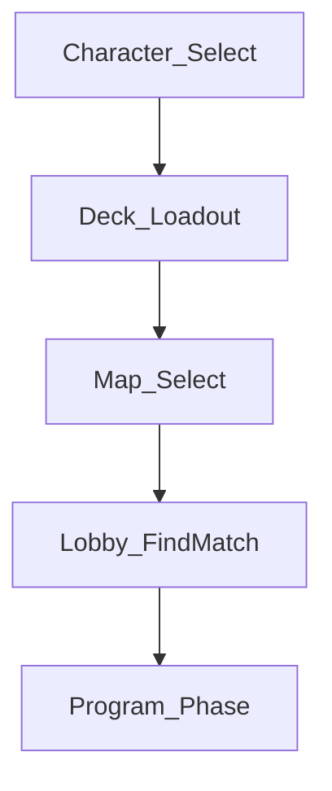

# Deckbuilder Systems Brief (C64 / C66)

**Status:** Draft 2026-08-14 — Cards restaff after C66 merge. **Docs only.** Does **not** open a coding contract and does **not** greenlight deckbuilder UI/Sim.
**Purpose:** Turn locked C64/C66 rules into a buildable systems shape so Integrator can open a frozen contract later (after Bandage HUD + enough staple conventions exist).
**Depends on:** [`PRODUCT_MEMORY.md`](../core/PRODUCT_MEMORY.md) **C64**, **C66**, **C47**, **C62**/**C63**; [`CARD_SYSTEM_OPENS.md`](CARD_SYSTEM_OPENS.md); [`CARD_COLLECTION.md`](CARD_COLLECTION.md); [`UI_FLOW.md`](../ui/UI_FLOW.md); [`PLAYBACK_CONTRACT.md`](../core/PLAYBACK_CONTRACT.md).
**Sibling pattern:** [`GEAR_BANDAGE_AGENT_BRIEF.md`](GEAR_BANDAGE_AGENT_BRIEF.md) (how a Cards brief feeds a later contract).

---

## 1. What's already locked (do not re-litigate)

| Fact | Source |
|------|--------|
| Hybrid: Character **signature** + personal deck from **shared library** | **C64** |
| Players may bring **different** cards in one match | **C64** |
| Deck + hand **hidden**; Character pick **public** | **C64** |
| Library + signatures **free forever** (no pay-to-win unlocks) | **C64** / **C47** |
| Deck size **5–8**; ≤**2** copies of the same library card | **C66** |
| In-match = **always-have** constructed hand; **no draw RNG** | **C66** |
| Signature = **extra** outside 5–8, always available, **costs TR** | **C66** |
| Played cards visible at **Reveal** (with the rest of the program) | **C66** |
| Attack/Defend labels do **not** constrain decks | **C66** |
| First-wave four = **shared-library**; Adrenaline stays **Execute** special | **C66** |
| Shipping staples stay on **transitional full-hand** until this layer lands | **C64** / **C62** / **C63** |

**Still OPEN (block a full builder contract):** exact fixed deck count inside 5–8; per-signature TR magnitudes; Flashbang/Interact numerics; Adrenaline real effect; Bomber/Time Player signature briefs.

---

## 2. Two horizons (do not collapse them)

| Horizon | What the player sees | Code implication |
|---------|----------------------|------------------|
| **Shipping / transitional** | Same staple hand for both sides (Bandage…) + charges | Keep `GearHandView` hard-coded staple list + Bandage HUD path. **Do not** invent deck RNG or loadout gates for Bandage. |
| **Long-term (this brief)** | Pre-match constructed deck → always-have hand + signature extra | New loadout → hand-source path. Staple resolve verbs stay; **access** changes. |

Transition rule: deckbuilder ships as a **cutover**, not a soft blend. Until cutover, transitional full-hand remains truth. After cutover, constructed deck + signature is truth; the hard-coded four-card staple list is retired (Adrenaline Execute slot may still be special-cased).

---

## 3. Screen / loop placement (proposal)

Today's map (`UI_FLOW.md`):

`Boot → Character Select → Map Select → Lobby → Program → …`

**Recommended insert:** a **Deck / Loadout** step **after Character Select** (signature known) and **before Lobby** (so matchmaking carries a frozen loadout).

Rationale: Character pick gates which signature is auto-attached; Map Select does not affect legal library cards under C66. Exact order vs Map Select is an OPEN below if Integrator prefers Map-first.

**In-match:** Program hand = constructed library cards (always available, charge-gated) + signature slot (always available, TR-gated). Opponent never sees unplayed hand; played cards flip at Reveal (**C66**).

---

## 4. Data model (proposed — not frozen)

### 4.1 Catalog (shared library + signatures)

Extend beyond today's four `CardId`s without breaking Bandage:

| Concept | Shape | Notes |
|---------|-------|-------|
| **Library card def** | Scriptable / data row: id, display, TR cost, charge rules, Program vs Execute phase | Today's `CardData` is a stale four-card scaffold — widen `oncePerMatch: bool` → charge count; do not trust asset numerics blindly (see Bandage brief §2). |
| **Signature def** | Per-Character: card id + unique verb id + TR cost | Bomber / Time Player stay long-term; Scout/Juggernaut may have **no** signature in early cutover. |
| **Personal deck** | Ordered or multiset list of library card ids, length in **[5,8]**, ≤2 per id | Exact fixed length OPEN (see §6). |
| **Match loadout** | `{ characterId, deck[], signatureId? }` frozen at Lobby enter | What Host/relay validates; what Program hand is sourced from. |

### 4.2 In-match hand

- **Always-have:** every library card in the loadout deck is armable each Program if charges + budget allow.
- **No draw pile / discard RNG.**
- **Signature:** separate always-on slot, not counted in 5–8.
- **Adrenaline:** remains Execute-gated; may sit in library deck **or** keep a reserved Execute affordance — confirm at cutover (C66 allows special-case).

### 4.3 What already exists (read before assuming blank slate)

| Path | Relevance |
|------|-----------|
| `Assets/_Project/Cards/CardData.cs` + four `.asset`s | Pre-C62 scaffold; enum is the four staples only; no deck/loadout types. |
| `Assets/_Project/UI/GearHandView.cs` | Hard-coded staple hand UI — **transitional**. Long-term hand should be **data-driven from loadout**, not a second hard-coded list. |
| Bandage Sim (`ActionVerb.Bandage`, `BandageCharge`, `Healed`) | Pattern for per-match charge carry — reuse for other library charges later. |
| No `Deck` / `Loadout` / `Signature` types in Sim/Net yet | Greenfield for loadout serialization when a contract opens. |

---

## 5. Phased build order (Integrator-owned gates)

Do **not** start these until the prior gate is closed. Cards writes briefs; UI/Sim code only under frozen contracts.

| Phase | Deliverable | Owner seat | Gate |
|-------|-------------|------------|------|
| **A — now** | This brief + human answers to §6 | **Cards** | — |
| **B** | Exact deck count + loadout screen placement locked (tiny C# or amend C66 OPEN line) | Integrator + human | §6 Q1–Q3 |
| **C** | Bandage HUD merged + Healed presenter | **UI** then Integrator | Existing Bandage contract |
| **D** | Loadout data + validation (EditMode): size, copy cap, signature attach | Sim/Cards under contract | Phase B |
| **E** | Deckbuilder UI (construct 5–8 from library) | **UI** under contract | Phase D |
| **F** | Program hand sourced from loadout (retire hard-coded staple list) | UI + Boot wire | Phase E |
| **G** | Signature arm + Reveal presentation for played library/signature cards | UI + Playback | Character signature briefs; PLAYBACK_CONTRACT |
| **H** | Bomber / Time Player signatures | Character + Sim carve-outs | C43/C44 answers |

**Explicit non-goals for Phase A (this doc):** no Unity scenes, no `GearHandView` rewrite, no Flashbang effect, no Bandage HUD edits, no Net/loadout RPCs.

---

## 6. Open questions blocking a frozen contract

Answer these before Phase D/E code. Defaults in *italics* are Cards recommendations only.

1. **Exact deck size inside 5–8?** Fixed **6**, fixed **8**, or keep a **range** the builder enforces as min–max? *Recommend fixed **6** for first builder (fast, readable).*
2. **Where in the flow?** After Character Select (recommended) vs after Map Select vs inside Lobby as a panel?
3. **Deck persistence?** Per-profile saved decks vs construct every match from scratch? *Recommend 1–3 saved decks per profile, free edits forever (C47).*
4. **Scout / Juggernaut signatures at cutover?** None yet (library-only) vs placeholder signature cards with stub verbs? *Recommend **none** until C43/C44 land — signature slot hidden if Character has no signature def.*
5. **Adrenaline at cutover?** Must be included in the 5–8 / optional library pick / always-on Execute affordance outside the deck? *Recommend keep Execute affordance outside deck (mirrors today's special slot) so blind Program isn't forced to "waste" a deck slot on a Playback card.*
6. **Validation authority?** Client cosmetic-only + Host/relay rejects illegal loadouts (preferred, matches resolve-relay **C52**) vs trust client for local demo only?
7. **Reveal UX for cards?** Same short face-up flash as program beats, or a dedicated card-flip beat in the Reveal flash? (Presentation only — does not change C66 timing.)

---

## 7. Contract sketch (for Integrator later — not opened)

When human answers §6, a future `contracts/CURRENT.md` slice should freeze roughly:

- `MatchLoadout` value type (character, library card ids, optional signature id).
- `LoadoutRules.Validate(deck, signature, catalog)` → size / copies / ownership.
- Program hand API: `IEnumerable<ArmableCard> HandFor(loadout, chargeState, phase)`.
- UI: Deckbuilder screen owns construction; `GearHandView` (or successor) binds to `HandFor`, not a hard-coded array.
- Out of scope in that first contract: Flashbang resolve, signature verb resolve, cosmetic binder, Net matchmaking payload beyond local 1v1 stub.

---

## 8. Relationship to Bandage / staples

- **Bandage HUD (UI, in flight)** stays on transitional full-hand. This brief must not divert that seat.
- When Phase F cutover happens, Bandage becomes "a library card that happens to be in the loadout," still using existing `ActionVerb.Bandage` / charge carry.
- Flashbang brief stays **paused** until re-derived as library tech; deckbuilder does not need Flashbang resolve to ship Phases D–F if the library at cutover is Bandage-only (plus empty slots / future ids).

---

## 9. Next step

1. Human answers §6 (or confirms recommended defaults).  
2. Cards amends this brief to **Answered** and offers Integrator a one-line C# / OPEN close for exact deck count if needed.  
3. Integrator opens Phase D contract only when Bandage HUD capacity allows a second UI/systems slice — **not** while Map + Bandage are both coding-hot unless human overrides capacity.

---

## See also

- [`CARD_SYSTEM_OPENS.md`](CARD_SYSTEM_OPENS.md) — Q1–Q8 source for **C66**  
- [`CARD_COLLECTION.md`](CARD_COLLECTION.md) — catalog + transitional vs long-term  
- [`CARD_SYSTEM_MODEL_COMPARISON.md`](CARD_SYSTEM_MODEL_COMPARISON.md) — hybrid conversation record  
- [`../departments/cards/STATUS.md`](../departments/cards/STATUS.md)
