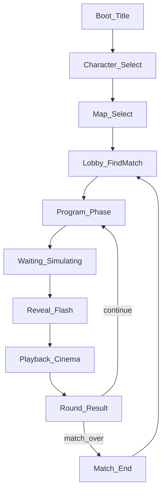

# D12: UI / UX Flow — Landscape Desktop (Steam)

**Doc ID:** D12  
**Status:** Updated 2026-08-10 — landscape desktop-first (**C48**); matchmaking lobby (**C51** / **C49**); Map Select step added (**C59**)  
**Depends on:** [GDD.md](../core/GDD.md), [TDD.md](../core/TDD.md), [ART_DIRECTION.md](../core/ART_DIRECTION.md), [PRODUCT_MEMORY.md](../core/PRODUCT_MEMORY.md)  
**Platforms:** Windows (mouse + keyboard, landscape desktop) primary; Steam first; portrait/mobile deferred to a future, separate consideration (**C48**).

Glossary (**C27**): **Time Resource** = budget scrubber; **Playback Duration** = cinema length; **Real-world** = wall-clock only (e.g. Program countdown).

---

## Screen map

---

## 1. Boot / Title

- Game name + **Play**.  
- Minimal; no settings deep dive in early ship.

---

## 2. Character Select

- Pick **Scout** or **Juggernaut** (attrs readable: Speed / Agility / Strength one-liners).  
- Confirm → Map Select.
- **Animation reference (not yet implemented):** [`UI_CHARACTER_SELECT_ANIMATION_REF.md`](UI_CHARACTER_SELECT_ANIMATION_REF.md)
  — a pasted React/Tailwind carousel spec marked as the target *motion feel* for this screen (crossfade
  role rotation: center/flank/back), now also covers a GSAP-based 3D depth-stack alternative (ReactBits
  DepthCarousel). Reference for the animation language only, not a literal build task or a stack we're
  adopting.
- **See also:** [`UI_TOOLS_RESEARCH.md`](UI_TOOLS_RESEARCH.md) — tool/pack recommendation for future UI polish (uGUI stay-default; not a build task in that research slice).

---

## 2b. Map Select (added 2026-08-10, `PRODUCT_MEMORY.md` C59)

- Pick **Freight Yard**, **Rail Platform**, or **Vault Complex** — three-card grid, same simplicity level
  as Character Select (reuses `SelectionGrid`), not the elaborate carousel references saved for Character
  Select above.
- Confirm → Lobby.
- **Local-only** — the choice just picks which `MapId` this client's own `GameBootstrap.BuildBoard()`
  call uses. No network sync of the pick (Net/Timeline work stays paused under the standing
  core-gameplay-pause rule; only map/terrain Sim-layer work is currently unpaused, per **C57**).
- Closes the map-select follow-up **C57** explicitly deferred when the three-map roster first landed.

---

## 3. Lobby (1v1)

- **Find Match** → enter queue.  
- Matched with a human opponent, or (after a timeout defined in `AI_FALLBACK_BOT.md`) invisibly paired with the matchmaking-fallback bot (**C49**).  
- Labels: Attacker / Defender (spawn only).  
- Session/topology details live in `NETWORKING_DESIGN.md` — not this doc.  
- Local/offline play remains available for testing.

---

## 4. Program Phase (core UX)

**Layout (landscape desktop — C48):** board is centered and dominant (majority of a 16:9 frame). Status and verb controls live in the margins — not a bottom thumb zone.

| Region | Frame role | Content | Input |
|--------|------------|---------|-------|
| **Top bar** | Slim status strip | **Real-world** Program countdown (e.g. 30s), round/phase label, wound badges. | Read-only |
| **Board** | Dominant center (majority of 16:9) | Diorama board (tilt-shift camera). **线稿涂鸦** path while drawing (FragPunk-A ink on clay — ART_DIRECTION). | Click to place waypoints / aim points |
| **HUD dock** | Side or bottom margin | **Time Resource scrubber**, stance/shoot-mode selectors, **Lock In**; gear cards when in scope. | Mouse-driven (click / scrub) |

**HUD dock rules:**

- **Lock In** is a clear primary action in the dock (mouse click), not a thumb-arc placement.
- Cards (when in scope) are a dock strip — click to arm, then click board target.
- Scrubber sits in the dock so scrubbing never covers the board.
- Path drawing is click-to-place waypoints (mechanically unchanged) — not free scribble.

**Flow:**

1. **Move (base verb):** click pawn → set path via waypoint clicks → pick stance (Sprint / Walk / Crawl); Time Resource cost updates automatically.  
2. **Shoot (base verb):** aim point → mode Snap / Hold Angle; Time Resource cost updates automatically.  
3. **Cards:** click Bandage / Interact / Flashbang to arm, then click the path node or scrubber time to place. Adrenaline is **Execution-only** (hidden or disabled here).  
4. Client validates TR budget fit before Lock allowed.  
5. Timer hit 0 or Lock → freeze input.

Camera pan (optional drag) and keyboard shortcuts are welcome on desktop — two-handed mouse+keyboard makes them genuinely useful, not optional convenience only.

---

## 5. Waiting / Simulating

- Full-screen or modal: **“Simulating…”**  
- No board interaction. Host running ghost (**TDD** Phase 3).

---

## 6. Reveal (short)

- Brief flash: enemy path/cards visible (or silhouette) — keep **&lt;2 real-world seconds** unless playtest wants longer.  
- Then auto-enter Playback.

---

## 7. Playback (Cinema)

- Same board; paths may ghost.  
- Scrubber plays in **Playback Duration** time (may be faster than Time Resource).  
- Optional dual readout later: TR marker vs playback head — one scrubber showing event order is enough if labels say “Playback.”  
- **Adrenaline:** large button during Playback, **1/match**, only while you have an active segment.  
- No pause required for early ship; Skip optional for debug builds only.

---

## 8. Round Result

- Healthy / Wounded / Dead summary.  
- **Continue** (next Program) or **Match Over** if Dead/Draw.

---

## 9. Match End

- Winner / Draw.  
- **Rematch** → Lobby. **Quit** → Title.

---

## Interaction rules (all Program UI)

| Rule | Spec |
|------|------|
| Orientation | **Landscape**, resizable window, target **16:9** (**C48**) |
| Reach | Primary actions live in the HUD dock (side or bottom margin); board clicks are clear, forgiving targets |
| Gestures | Mouse click for required actions; optional drag-to-pan camera; optional keyboard shortcuts |
| Click targets | Standard desktop click-target sizing (comfortable hit areas for mouse; Lock In / Adrenaline remain large primary actions) |
| Contrast | AR timeline readable on clay board ([ART_DIRECTION.md](../core/ART_DIRECTION.md)) |
| Feedback | Lock In = physical switch SFX; card select = paper shuffle |
| Errors | Invalid path/budget → inline message, cannot Lock |

---

## Build history

Historical UI milestones already landed (see `docs/SCHEDULE.md` Day ticks). Not a forward-looking target list.

| Slice | UI that shipped |
|-------|-----------------|
| **1** | Minimal Program (click destination Move + aim Shoot), Lock, scrubber, Playback move/shoot distinct |
| **2** | Path waypoints + stance allotment UI; Snap vs Hold mode toggle |
| **3** | Wound state badge; Bandage/Interact; door feedback |
| **4** | Lobby codes; Simulating; Adrenaline during Playback; gadgets as able |

---

## Acceptance

1. Cold user can Lock a Move + Shoot without a coach.  
2. Never labels Playback as “real-world time.”  
3. Steam Windows build runs a **landscape** layout; mouse + keyboard only, no touch requirement.  
4. Lock In and Adrenaline remain large, obvious primary actions under mouse.  
5. A full round can be completed with mouse + keyboard alone.
